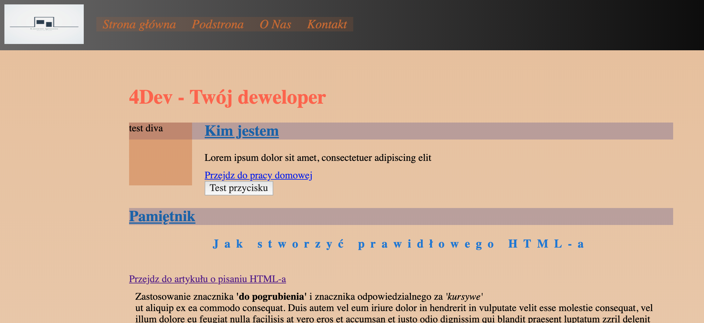

# wtf-gulp-starter

## wymagany gulp starter kit 

[Pobierz gulp-a](https://www.npmjs.com/package/gulp-starter-kit)

`npm install -g gulp-cli`

`npm install`

`gulp`

To publish your page using github pages use `npm run deploy`
